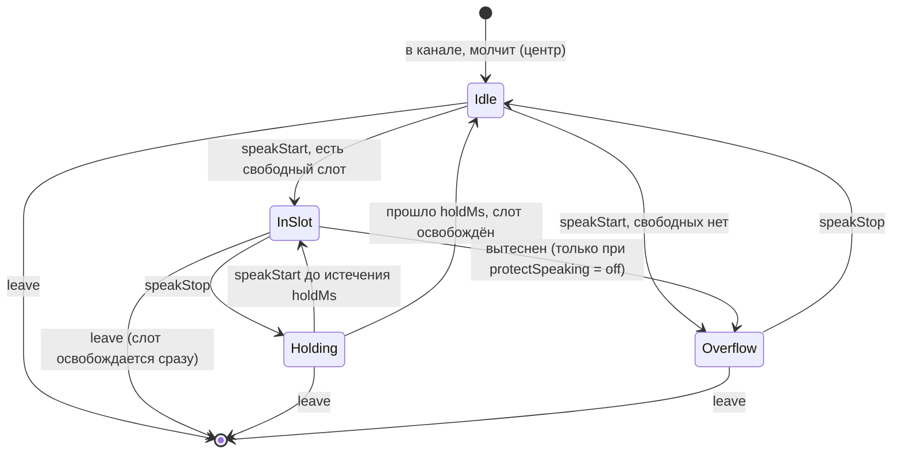

# MORKOV — Project Definition

Плагин BetterDiscord, который раскладывает голоса участников звонка по стереопанораме, чтобы в большой компании речь не сливалась в кашу.

Статус: discovery завершён, архитектура согласована 2026-09-29. Код ещё не написан.

---

## 1. Problem

Когда в голосовом канале Discord говорят несколько человек, все голоса звучат из одной точки, по центру. При одновременной речи голоса сливаются, трудно понять, кто что сказал. Discord передаёт голос в моно и в стабильной версии не даёт развести участников по сторонам.

Как решают сейчас: никак. Существующие попытки:
- [autopan](https://github.com/allenwp/autopan): второй аккаунт-«бот» сводит звук, у всех участников нужно вручную выключать громкость. Только Windows, заброшен в 2022.
- [discord-spatial-audio](https://github.com/Goldartfrog/discord-spatial-audio) (Vencord): меняет только громкость по расстоянию, без панорамы.
- Встроенный Spatial Audio Discord: с мая 2026 в эксперименте Canary, только статичная раскладка (линия, дуга, сетка, ручная карта). Динамики по говорящим нет.

## 2. Goal

Полезный инструмент, которым реально пользуются: слушатель в наушниках различает одновременно говорящих людей по направлению.

Отличие от встроенного Spatial Audio — **динамическая панорама**: ограниченное число слотов занимают те, кто говорит сейчас; замолчавший уступает место следующему.

## 3. Users

| Кто | Контекст |
|---|---|
| Геймеры | Большие компании в войсе во время игры |
| Стримеры | Разложенный звук Discord попадает в OBS как есть, зрители тоже слышат панораму |
| Любые большие компании в звонках | — |

Ролей и прав нет: плагин локальный, у каждого пользователя своя раскладка, видимая и слышимая только ему. Другим участникам плагин не нужен.

Требования к пользователю: Discord для desktop (macOS, Windows), установленный BetterDiscord, **наушники**. В колонках эффект почти не слышен, это ограничение идеи, а не реализации.

## 4. Core use cases

### UC-1. Динамическая панорама в большой компании

```
Actor: слушатель (режим «Динамика», 5 слотов, удержание 3 с)
Action: в канале 8 человек, говорят то одни, то другие
Input: события Discord «X начал / перестал говорить»
Processing: X начал говорить → есть свободный слот → X занимает его;
            X замолчал → слот удерживается 3 с → освобождается
Side effects: setLocalPan(X, left, right) в нативном голосовом движке
Persistence: нет (раскладка динамики живёт только в памяти)
Output: X слышен со стороны своего слота
```

### UC-2. Перегрузка слотов

Говорят одновременно 7 человек, слотов 5.
- «Не двигать говорящего» включено (по умолчанию): двое лишних звучат по центру. Слот они получат при следующем начале речи, если к тому моменту что-то освободится. Посреди фразы никого не двигаем.
- Выключено: новый говорящий вытесняет из слота того, кто занимает его дольше всех, а вытесненный уходит в центр.

### UC-3. Статичная раскладка

Режим «Статика»: участники раскладываются в порядке, в котором их отдаёт Discord (фактически порядок входа), либо по 5 слотам (лишние делят слоты по кругу), либо равномерно по N точкам. Выбор — в настройках. Кто-то вошёл или вышел — раскладка пересчитывается. Стабильность между сессиями не требуется.

### UC-4. Закрепление

ПКМ по участнику → «Панорама» → «Закрепить слева». Закреплённый держит свою позицию в любом режиме, даже когда молчит. Динамика его не трогает. Закрепление глобальное (на всех серверах и в звонках) и сохраняется между перезапусками. На одной позиции можно закрепить нескольких человек.

### UC-5. Выключение

Режим «Выкл», выключение плагина, выход из канала: все участники возвращаются в центр. После плагина не должно оставаться перекошенного звука.

### UC-6. Discord обновился, API сломался

При старте (и при входе в канал) плагин проверяет наличие нужных внутренних API. Если чего-то нет, плагин выключается, возвращает центр, если это ещё возможно, и показывает уведомление «MORKOV: несовместимая версия Discord». Работать наполовину не пытается.

### Edge cases
| Ситуация | Поведение |
|---|---|
| Собственный голос | Не панорамируется, свой userId исключаем |
| Участник вышел, пока говорил или удерживал слот | Слот освобождается сразу |
| Участник, которого пользователь заглушил локально | Открытый вопрос (OQ-5) |
| Музыкальный бот в канале | Обычный участник, его можно закрепить |
| Короткие паузы при речи | Сглаживаются временем удержания |
| Смена канала | Сброс в центр в старом, новая раскладка в новом |
| Слотов стало меньше, чем закреплённых позиций | Закрепления хранятся как позиция −1..1 и привязываются к ближайшему слоту |

## 5. Functional requirements

| ID | Требование |
|---|---|
| FR-1 | Режимы: Выкл / Статика / Динамика, переключение без перезапуска |
| FR-2 | Динамика: слот назначается в момент начала речи, освобождается через `holdMs` после окончания |
| FR-3 | Динамика: переключатель «Не двигать говорящего» (вкл: лишние в центр; выкл: вытеснение самого давнего) |
| FR-4 | Выбор свободного слота — «по кругу»: берём слот, свободный дольше всех |
| FR-5 | Статика: раскладка по слотам или равномерно по N точкам (настройка) |
| FR-6 | Закрепление участника на позиции через контекстное меню; снятие закрепления; несколько человек на одной позиции разрешены |
| FR-7 | Настройки: режим, число слотов (по умолчанию 5), `holdMs` (по умолчанию 3000), ширина стереобазы, тип статики, «не двигать говорящего», подробные логи |
| FR-8 | Настройки и закрепления сохраняются локально между перезапусками |
| FR-9 | Работает в серверных голосовых каналах, личных и групповых звонках |
| FR-10 | Сброс всех в центр при выключении, выходе, режиме «Выкл» |
| FR-11 | Проверка совместимости и полное отключение при несовместимости |
| FR-12 | Автообновление из GitHub через `@updateUrl` BetterDiscord |

Вне MVP: визуальная индикация слотов в интерфейсе, 3D/HRTF, мобильные клиенты.

## 6. Non-functional requirements

| ID | Требование | Как проверяем |
|---|---|---|
| NFR-1 | Позиция применяется до того, как слушатель заметит первое слово не с той стороны. Числа нет — измеряем на слайсе 1 | Подробные логи: время от события `SPEAKING` до `setLocalPan` |
| NFR-2 | Никакого сетевого трафика, никакой телеметрии | Ревью кода, в коде нет `fetch`/`XMLHttpRequest`/`WebSocket` (обновление делает BetterDiscord, а не плагин) |
| NFR-3 | Незаметная нагрузка на клиент: работа по событиям, один таймер, без поллинга | Ревью и профайлер DevTools на созвоне |
| NFR-4 | Ноль runtime-зависимостей в собранном файле | Проверка в CI |
| NFR-5 | Отказ безопасный: при любой ошибке звук возвращается в центр, а не остаётся перекошенным | Юнит-тесты Applier + ручной смоук |
| NFR-6 | Поддержка: macOS проверяется, Windows поддерживается формально без тестирования | README |

Не относятся к проекту (сервера нет): масштабирование, доступность, бэкапы, консистентность, rate limiting.

## 7. MVP

Всё из раздела 5 (FR-1…FR-12) на macOS в серверных каналах и звонках, механизм `setLocalPan`.

Порядок получения ценности: сначала ручная панорама одного человека (доказательство, что механизм работает), потом статика, потом динамика (главное отличие), потом закрепления и полировка.

## 8. Out of scope

- Бот и веб-плеер (разобраны и отвергнуты для MVP, см. ADR-001)
- Мобильные клиенты, веб-версия Discord
- Vencord / Equicord
- 3D-звук через `setUserPosition` и встроенный Spatial Audio Discord
- Визуальная индикация слотов
- Синхронизация настроек между устройствами, общая раскладка на компанию
- Телеметрия, аналитика, любые серверы
- Публикация в каталоге BetterDiscord (только свой GitHub)
- Звук стримов Go Live, soundboard, Stage-каналы

## 9. Architecture

Принцип: **функциональное ядро и императивная оболочка.** Вся логика (слоты, удержание, закрепления, раскладки) — чистый TypeScript без Discord и таймеров, время передаётся параметром. Оболочка только транслирует события Discord в вызовы ядра, а решения ядра в `setLocalPan`.

```mermaid
flowchart LR
    U[Пользователь в наушниках] -->|ПКМ / настройки| UI

    subgraph Discord desktop + BetterDiscord
        subgraph MORKOV plugin
            UI[UI: контекстное меню<br/>+ панель настроек]
            ST[(Настройки<br/>BdApi.Data)]
            AD[Discord-адаптер]
            CORE[Ядро: LayoutEngine<br/>чистый TS]
            AP[Applier:<br/>pan law, повторное применение]
            COMPAT[Проверка совместимости]
            LOG[Логи в консоль<br/>MORKOV]
        end
        FLUX[Flux: SPEAKING,<br/>VoiceState] -->|кто говорит, кто в канале| AD
        VE[Нативный голосовой движок<br/>discord_voice]
    end

    UI --> ST
    ST --> CORE
    AD -->|события + время| CORE
    CORE -->|целевые позиции −1..1| AP
    AP -->|setLocalPan userId,left,right| VE
    COMPAT -. нет API → выкл, центр, уведомление .-> AD
    CORE -.-> LOG
    AP -.-> LOG

    GH[GitHub Releases] -.->|@updateUrl, проверяет BetterDiscord| U
```

Все взаимодействия синхронные и внутрипроцессные. Очередей, воркеров, кэша и сервера нет, потому что для них нет причины.

## 10. Components

| Компонент | Ответственность | Зависит от Discord |
|---|---|---|
| **LayoutEngine** (core) | Состояние участников и слотов, правила режимов. Вход: события (`join`, `leave`, `speakStart`, `speakStop`, `tick`, `settingsChanged`) с временем. Выход: карта `userId → позиция −1..1` и время следующего пересчёта | Нет |
| **Positions** (core) | Расчёт позиций слотов и равномерной раскладки с учётом ширины стереобазы, привязка закреплений к ближайшему слоту | Нет |
| **PanLaw** (core) | Позиция → (left, right) по закону равной мощности | Нет |
| **Discord-адаптер** | Поиск модулей через `BdApi.Webpack`, подписка на Flux `SPEAKING` и изменения VoiceState, определение текущего канала и своего userId | Да |
| **Applier** | Хранит желаемую панораму и применяет только изменения; повторно применяет после событий, сбрасывающих панораму; сброс в центр | Да |
| **Compat** | Проверка наличия MediaEngine, `setLocalPan`, SpeakingStore/Flux. Результат: ок или отказ с причиной | Да |
| **Settings** | Схема, значения по умолчанию, валидация, миграции по `schemaVersion`, чтение и запись `BdApi.Data` | Только хранилище |
| **UI** | Подменю «Панорама» в ПКМ по участнику (`BdApi.ContextMenu`), панель настроек плагина | Да |
| **Scheduler** | Единственный таймер: будит ядро ко времени следующего освобождения слота | Нет (инъекция) |

### Алгоритм динамики (жизненный цикл участника)



Закреплённые участники в этой машине не участвуют: их позиция фиксирована, а их слот исключён из пула динамики.

## 11. Data model

Персистентные данные — одна запись настроек. Состояние раскладки живёт только в памяти и после перезапуска не нужно.

```ts
// BdApi.Data("MORKOV", "settings")
interface Settings {
  schemaVersion: 1;
  mode: "off" | "static" | "dynamic";
  slotCount: number;          // 1..9, по умолчанию 5
  holdMs: number;             // 0..30000, по умолчанию 3000
  stereoWidth: number;        // 0..1, по умолчанию 1.0 (края в самые уши)
  staticLayout: "slots" | "even";
  protectSpeaking: boolean;   // по умолчанию true
  pins: Record<string, number>; // userId → позиция −1..1
  debugLogs: boolean;
}
```

- Ownership: только локальный пользователь.
- Валидация при чтении: неизвестные или битые поля заменяются значениями по умолчанию, диапазоны зажимаются. Файл настроек мог быть отредактирован руками.
- Миграции: функция `migrate(raw) → Settings` по `schemaVersion`, покрыта юнит-тестами.
- Удаление: снятие закрепления удаляет ключ. Аудит и история не нужны.

## 12. API / contracts

Внешнего API нет. Контракты два.

**Внутренний контракт ядра** (граница, по которой проходят юнит-тесты):
```ts
engine.handle(event: EngineEvent, nowMs: number): {
  positions: Map<UserId, number>;   // полная целевая раскладка
  nextWakeAtMs: number | null;      // когда разбудить для освобождения слота
}
```

**Контракт с Discord** (неофициальный, может сломаться при любом обновлении, проверяется Compat):
| API | Где найден | Назначение |
|---|---|---|
| `setLocalPan(userId, left, right)` | `discord_voice/index.js` (app-0.0.413), флаг `voice_panning` | Панорама |
| `setLocalVolume(userId, volume)`, `setLocalMute(userId, mute)`, `setUserPosition(userId, position)` | `discord_voice/index.js` (app-0.0.413) | Громкость, заглушение, позиция для встроенного Spatial Audio. Обёрнуты вместе с `setLocalPan` в `src/voice.ts`; шкала `volume` и форма `position` не подтверждены |
| Flux `SPEAKING` / SpeakingStore | Клиент Discord, используется плагином VoiceBalancer | Кто говорит |
| VoiceState store | Клиент Discord | Участники канала, свой канал |
| `BdApi.Data`, `BdApi.ContextMenu`, `BdApi.Webpack`, `BdApi.Patcher`, `BdApi.UI` | BetterDiscord | Хранилище, UI, поиск модулей, перехват, уведомления |

Шкала `left/right` у `setLocalPan` пока не подтверждена (OQ-1).

## 13. Infrastructure

| Окружение | Что это |
|---|---|
| local | macOS, Discord + BetterDiscord, собранный файл ссылкой или копией в `~/Library/Application Support/BetterDiscord/plugins/` |
| CI | GitHub Actions |
| «production» | GitHub Release с `MORKOV.plugin.js`, откуда BetterDiscord берёт обновления |

Test/stage-окружений нет: их роль выполняют тестовые созвоны с друзьями на локальной сборке.

Стек:
- TypeScript, esbuild → один `MORKOV.plugin.js` с мета-заголовком BetterDiscord (`@name`, `@version`, `@updateUrl`, ...)
- vitest для тестов, ESLint
- npm, Node LTS
- Никаких runtime-зависимостей

Rollback: пользователь кладёт предыдущий `.plugin.js` из релизов; для автообновления — выпуск новой версии, откатывающей изменения.

## 14. Security

Модель угроз маленькая: плагин исполняется с полными правами клиента Discord, но ничего не принимает из сети и никуда не отправляет.

| Угроза | Мера |
|---|---|
| **Взлом GitHub-аккаунта → вредоносное автообновление всем пользователям** (главный риск) | 2FA на GitHub, защищённая ветка `main`, релизы только из CI по тегу |
| Supply chain через npm | Ноль runtime-зависимостей; dev-зависимости минимальны, lock-файл, Dependabot |
| Битые или подменённые настройки | Валидация и зажатие диапазонов при чтении |
| Утечка данных | Сети нет. В логах только userId, без имён и содержимого переписки |
| Нарушение ToS Discord (клиентский мод) | Предупреждение в README: риск на пользователе |

XSS, CSRF, SSRF, инъекции, аутентификация, rate limiting: неприменимо, нет ни сервера, ни ввода из сети.

## 15. Testing strategy

| Уровень | Что тестируем | Что НЕ тестируем | Зависимости | Где запускается |
|---|---|---|---|---|
| **Unit** (основной объём) | LayoutEngine: все режимы, удержание, перегрузка, вытеснение, закрепления, leave; Positions; PanLaw; Settings (валидация, миграции) | Discord | Время и таймер подставные, без моков Discord | Локально и в CI, миллисекунды |
| **Unit оболочки** | Applier: применяет только разницу, сброс в центр, повторное применение, fail-safe | Реальный голосовой движок | Фейковый `setLocalPan` | Локально и в CI |
| **Build check** | Бандл собирается, мета-заголовок корректный, нет запрещённых вызовов (`fetch`, `WebSocket`, `XMLHttpRequest`), нет runtime-зависимостей | — | — | CI |
| **Ручной смоук** | Чек-лист в `docs/SMOKE.md`: загрузка и выгрузка, ручная панорама, режимы, закрепления, сброс, звонки в ЛС | — | Живой Discord на macOS | Перед каждым релизом |
| **Тестовый созвон** | Субъективно: помогает ли различать, не раздражает ли динамика, подбор `holdMs` и ширины | — | 3–6 живых людей | На слайсах 3–5 и перед релизом |

Инварианты ядра проверяются тестами на случайных последовательностях событий:
1. Говорящий не сдвигается, пока `protectSpeaking = true`.
2. Позиция закреплённого участника не меняется ни при каких событиях.
3. В одном динамическом слоте не больше одного участника (центр переполнения не считается слотом).
4. Слот освобождается не раньше, чем через `holdMs` после `speakStop`.
5. Свой userId никогда не получает позицию.

Не делаем: E2E-автоматизацию Discord (хрупко и бессмысленно), нагрузочные тесты, контрактные тесты.

## 16. Observability

- Логи в консоль DevTools Discord с префиксом `[MORKOV]`: всегда — старт, стоп, результат Compat, ошибки; при `debugLogs` — каждое событие ядра, назначение и освобождение слота, вызовы `setLocalPan`, задержка от события до применения.
- Ответы на вопросы:
  - *Что произошло?* Событие и решение ядра в логе.
  - *Почему упало?* Compat пишет, какого API не хватает; ошибки ловятся на границе оболочки и переводят плагин в безопасное состояние.
  - *Сколько заняло?* Задержка `SPEAKING → setLocalPan` в логе.
- Метрик, трейсов и error tracking нет: сети нет по требованию. Баг-репорт от пользователя = кусок лога из консоли.

## 17. CI/CD

GitHub Actions:
- **На каждый push и PR:** `npm ci` → проверка типов → lint → unit → сборка → build check.
- **На тег `v*`:** всё то же + GitHub Release с `MORKOV.plugin.js`. Версия в мета-заголовке берётся из тега.
- `@updateUrl` указывает на `https://github.com/glob707/MORKOV/releases/latest/download/MORKOV.plugin.js`.

## 18. Risks

| Risk | Probability | Impact | Why it matters | Mitigation |
|---|---|---|---|---|
| Discord перезаписывает панораму (как было с `setLocalVolume` у VoiceBalancer) | Средняя | Высокое | Раскладка «слетает» | Выясняем на слайсе 1; Applier применяет повторно; при необходимости перехват через `BdApi.Patcher` |
| Обновление Discord ломает внутренние API | Высокая (со временем) | Высокое | Плагин перестаёт работать | Compat + fail-safe (FR-11), быстрый патч-релиз |
| Discord выпускает встроенный Spatial Audio | Высокая | Среднее | Статика обесценивается | Отличие — динамика; при необходимости переход на `setUserPosition` без изменения ядра |
| Задержка сигнала «говорит» — первое слово звучит не с той стороны | Средняя | Среднее | Динамика раздражает | Измерение на слайсе 1 (NFR-1); время удержания |
| Динамика субъективно сбивает сильнее, чем помогает | Средняя | Высокое | Главная гипотеза не подтвердится | Тестовые созвоны на ранних слайсах; статика и закрепления как запасной вариант |
| Взлом GitHub → вредоносное автообновление | Низкая | Критическое | Код на машинах всех пользователей | 2FA, защита веток, релиз только из CI |
| Windows не тестируется | Высокая | Среднее | Скрытые баги на основной платформе геймеров | Просить Windows-пользователей из друзей о смоуке; README |
| Бан за клиентский мод | Низкая | Высокое для пользователя | Особенно чувствительно для стримеров | Предупреждение в README |
| Внутреннее API звонков в ЛС отличается от серверных каналов | Средняя | Низкое | FR-9 частично не работает | Проверка на отдельном слайсе |

## 19. ADRs

### ADR-001. Плагин BetterDiscord, а не бот
- **Context:** хотелось «ничего не ставить, работает у всех, на телефоне». Нужна раскладка, своя у каждого слушателя.
- **Decision:** плагин BetterDiscord, панорама локально в клиенте.
- **Alternatives:** бот в канале; бот + веб-плеер; внешний захват звука; расширение для веб-версии; Vencord.
- **Why:** бот отдаёт один поток на всех — нет своей раскладки у каждого, слушатель слышит собственный голос с задержкой (эхо). Бот + веб-плеер решает это, но добавляет сервер, задержку 150–400 мс, неофициальный приём голоса, E2EE DAVE и прокачку чужих голосов через свой сервер без согласия участников. Захват звука не может разделить участников. Веб-версией геймеры почти не пользуются. У Vencord сторонние плагины неудобно распространять.
- **Trade-offs:** нужен мод (ToS), нет телефона, хрупкость при обновлениях Discord.
- **Consequences:** ядро пишется без зависимостей от Discord, чтобы при необходимости переиспользовать его в веб-плеере.

### ADR-002. `setLocalPan`, а не `setUserPosition` / встроенный Spatial Audio
- **Context:** в голосовом движке есть и стереопанорама, и 3D-позиционирование (Steam Audio, HRTF), но второе закрыто флагом `isSpatialAudioEnabled`.
- **Decision:** MVP на `setLocalPan`.
- **Why:** работает в стабильном Discord, простая модель, не зависит от закрытого эксперимента.
- **Trade-offs:** в обычном стерео уверенно различается меньше позиций, чем в HRTF.
- **Consequences:** ядро выдаёт абстрактную позицию −1..1; замена «исполнителя» на `setUserPosition` не затрагивает ядро.

### ADR-003. Функциональное ядро без Discord
- **Decision:** вся логика раскладки — чистые функции со временем в параметре; Discord только в адаптере и Applier.
- **Why:** это самая сложная и рискованная часть, а автоматически тестировать живой Discord невозможно.
- **Trade-offs:** немного больше кода на трансляцию событий.
- **Consequences:** почти все автотесты — быстрые юнит-тесты; ядро переносимо (Vencord, веб-плеер).

### ADR-004. Сигнал «говорит» через Flux / SpeakingStore
- **Decision:** подписка на Flux `SPEAKING`, без нативного `setOnSpeakingCallback`.
- **Why:** нативный callback единственный и занят Discord; его переопределение ломает подсветку говорящих в интерфейсе.
- **Trade-offs:** возможна чуть большая задержка, чем у нативного callback (измеряем, NFR-1).

### ADR-005. Никакой сети и телеметрии; обновления через `@updateUrl`
- **Decision:** плагин не выполняет сетевых запросов. Обновления проверяет BetterDiscord по ссылке на GitHub Release.
- **Why:** требование владельца; приватность; доверие стримеров; нечего поддерживать.
- **Trade-offs:** нет данных об использовании и ошибках — только то, что пришлют люди.
- **Consequences:** GitHub-аккаунт становится каналом доставки кода, отсюда требования к безопасности (раздел 14).

## 20. Open questions

| ID | Вопрос | Где закрываем |
|---|---|---|
| OQ-1 | Шкала `setLocalPan(left, right)`: 0..1? Что считается «без панорамы»? | Слайс 1 |
| OQ-2 | Что сбрасывает панораму: синхронизация настроек, переподключение, смена устройства? Вызывает ли Discord `setLocalPan` сам? | Слайс 1, затем слайс 6 |
| OQ-3 | Задержка `SPEAKING → setLocalPan` и заметна ли она на первом слове | Слайс 1 (измерение), слайс 3 (созвон) |
| OQ-4 | Одинаково ли устроены серверные каналы и звонки в ЛС для MediaEngine | Слайс 6 |
| OQ-5 | Локально заглушённые участники: исключать из динамики, чтобы они не занимали слот? (Предложение — исключать) | Слайс 3 |
| OQ-6 | Разумные значения по умолчанию `holdMs` и `stereoWidth` | Тестовые созвоны |
| OQ-7 | Работоспособность на Windows | После релиза, силами друзей |

## 21. Future evolution

- 3D-звук через `setUserPosition` (HRTF) как альтернативный «исполнитель».
- Визуальная индикация слотов у аватарок.
- Порт на Vencord / Equicord (ядро переиспользуется).
- Бот + веб-плеер для телефона, если появится реальная потребность (ядро переиспользуется, см. ADR-001).
- Интеграция со встроенным Spatial Audio Discord, если он выйдет в стабильную версию: динамика поверх его движка.

Решения, которые сейчас важно не закрыть: ядро не знает о Discord; позиция абстрактная (−1..1); настройки версионируются.

---

## Implementation plan

Каждый слайс заканчивается работающим плагином, который можно поставить и послушать.

### Slice 0. Скелет, который загружается
- **Цель:** пустой плагин собирается, ставится в BetterDiscord, пишет в консоль при старте и остановке, CI зелёный.
- **Компоненты:** `package.json`, `tsconfig`, esbuild-скрипт с мета-заголовком, `src/index.ts` (start/stop), vitest, ESLint, `.github/workflows/ci.yml`, README (установка + предупреждение про ToS), LICENSE (MIT).
- **Тесты:** один тестовый юнит-тест как дымовая проверка каркаса; build check.
- **Готово, когда:** `npm run build` → файл в папке plugins → включение в BetterDiscord → `[MORKOV] started` в консоли; CI проходит.

### Slice 1. Ручная панорама одного человека (технический spike в коде)
- **Цель:** доказать механизм. ПКМ по участнику → «Панорама: слева / центр / справа» → слышно.
- **Компоненты:** Compat, минимальный адаптер (свой канал, участники), Applier с `setLocalPan`, PanLaw, простое подменю ПКМ, сброс в центр на stop.
- **Закрывает:** OQ-1 (шкала), OQ-2 (что сбрасывает, первая часть), OQ-3 (замер задержки `SPEAKING` при включённых логах).
- **Тесты:** unit PanLaw; unit Applier (фейковый `setLocalPan`: только разница, сброс в центр, fail-safe при исключении).
- **Готово, когда:** в созвоне с одним другом его голос уходит влево и вправо; при выключении плагина возвращается в центр; при искусственно «сломанном» API плагин выключается с уведомлением; задержка записана в этом документе.

### Slice 2. Статика
- **Цель:** режим «Статика» раскладывает всех автоматически.
- **Компоненты:** LayoutEngine (режимы off/static), Positions (slots/even, ширина), Settings (схема, валидация, `BdApi.Data`), минимальный переключатель режима в панели настроек, адаптер: `join`/`leave`/смена канала.
- **Тесты:** unit Positions, LayoutEngine static (вход, выход, перегрузка слотов по кругу), Settings (значения по умолчанию, зажатие, битый файл).
- **Готово, когда:** в созвоне с 3+ людьми все разложены; кто-то вышел — пересчиталось; «Выкл» — все в центре; режим сохраняется после перезапуска Discord.

### Slice 3. Динамика — главная функция
- **Цель:** слоты занимают говорящие, удержание, перегрузка в центр.
- **Компоненты:** LayoutEngine dynamic (машина состояний из раздела 10), Scheduler, адаптер: Flux `SPEAKING`, настройки `holdMs` и `protectSpeaking`.
- **Закрывает:** OQ-3 (на слух), OQ-5.
- **Тесты:** unit на все переходы машины; тесты инвариантов 1, 3, 4, 5 на случайных последовательностях; вытеснение при `protectSpeaking = off`.
- **Готово, когда:** тестовый созвон с 4–6 людьми и 5 слотами — говорящие занимают слоты, после паузы слоты освобождаются, при перегрузке лишние в центре; мнение участников записано.

### Slice 4. Закрепления
- **Цель:** ПКМ → «Закрепить слева / … / справа», «Снять закрепление».
- **Компоненты:** `pins` в Settings, учёт закреплений в LayoutEngine (обе раскладки, исключение слота из пула динамики, несколько человек на одной позиции), полное подменю ПКМ.
- **Тесты:** инвариант 2; привязка к ближайшему слоту при смене `slotCount`; сохранение и загрузка.
- **Готово, когда:** закреплённый друг остаётся слева в динамике, когда молчит, и после перезапуска Discord.

### Slice 5. Тонкая настройка
- **Цель:** полная панель настроек (FR-7) с мгновенным применением.
- **Компоненты:** UI панели (режим, слоты, удержание, ширина, тип статики, «не двигать говорящего», подробные логи), `migrate()` с `schemaVersion`.
- **Тесты:** unit миграций; unit `settingsChanged` в ядре (смена числа слотов на лету не двигает говорящих).
- **Готово, когда:** каждая настройка меняет поведение без перезапуска; подобранные на созвоне значения по умолчанию внесены (OQ-6).

### Slice 6. Звонки в ЛС и живучесть
- **Цель:** FR-9 полностью; панорама не слетает.
- **Компоненты:** адаптер для личных и групповых звонков; повторное применение Applier после переподключения, смены устройства вывода и других событий, найденных в OQ-2; при необходимости перехват через `BdApi.Patcher`.
- **Тесты:** unit Applier (повторное применение по событию); ручной смоук звонка в ЛС и групповом звонке.
- **Готово, когда:** в групповом звонке работает как в канале; после смены наушников в настройках Discord раскладка на месте.

### Slice 7. Релиз
- **Цель:** люди ставят и получают обновления сами.
- **Компоненты:** release-workflow по тегу, `@updateUrl`, README (установка, настройки, ограничения: наушники, macOS проверен, ToS), `docs/SMOKE.md`, 2FA и защита ветки на GitHub.
- **Тесты:** полный ручной смоук по чек-листу; проверка, что BetterDiscord видит обновление с `v0.1.0` на `v0.1.1`.
- **Готово, когда:** товарищ ставит плагин по README без вашей помощи и получает обновление автоматически.

---

## Definition of Done

Для каждой фичи и слайса:
- Функция работает в живом Discord на macOS, проверена руками.
- Логика ядра покрыта юнит-тестами, включая граничные случаи из раздела 4.
- Отказ безопасный: ошибка в оболочке ловится, звук возвращается в центр, в консоли понятная запись `[MORKOV]`.
- Для нового поведения есть подробный лог (`debugLogs`).
- В коде нет сетевых вызовов и runtime-зависимостей (build check проходит).
- CI зелёный: типы, lint, тесты, сборка.
- Обновлены README и этот документ (закрытые открытые вопросы, изменённые решения).
- Для слайсов с пользовательским эффектом: проверено на тестовом созвоне.
- Нет известных багов, после которых звук остаётся перекошенным.
